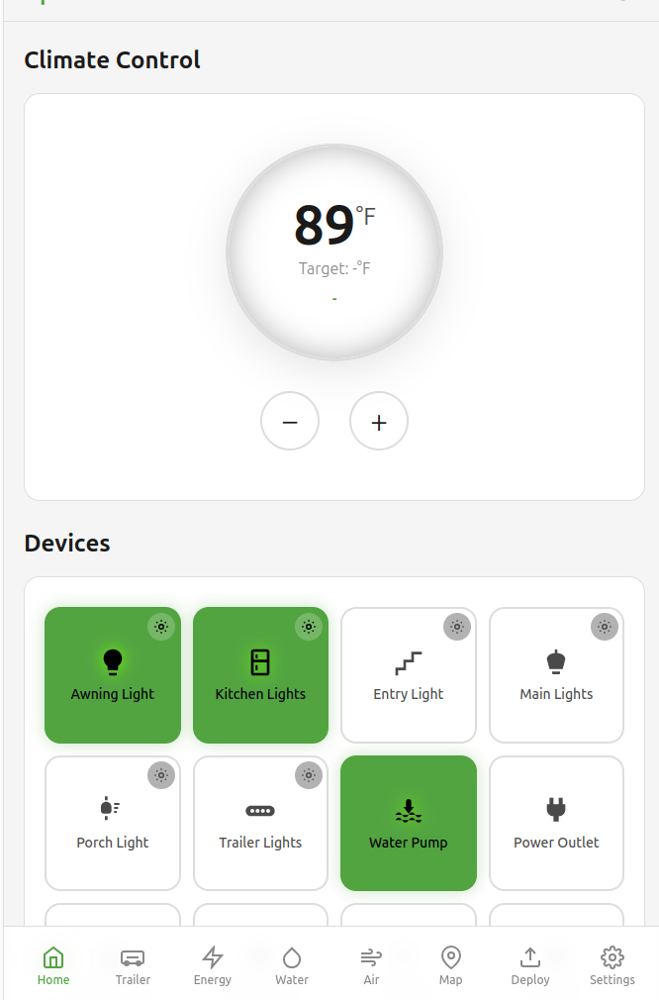

# TrailCurrent Farwatch

Cloud-hosted Progressive Web App (PWA) for remote monitoring and control of [TrailCurrent](https://trailcurrent.com) trailer systems. Provides a responsive web interface accessible from any browser.

<p align="center">
  
</p>

## Architecture

Dockerized microservices stack:

- **Frontend** - Nginx serving a vanilla JS PWA with HTTPS
- **Backend** - Node.js REST API with WebSocket support
- **MongoDB** - Document database for settings, state, and deployment metadata
- **Mosquitto** - MQTT broker (TLS) bridging cloud to vehicle
- **Tileserver** - Vector tile server for offline-capable maps

## Features

- **Thermostat Control** - Set temperature, view interior/exterior readings
- **Lighting** - Toggle 8 PDM-controlled devices with brightness adjustment
- **Energy Dashboard** - Battery voltage, SOC percentage, solar input, power consumption, charge status, time remaining
- **Water Tanks** - Fresh, grey, and black tank levels
- **Air Quality** - Temperature, humidity, IAQ index, CO2
- **Trailer Level** - Pitch and roll indicators
- **GPS/Map** - Real-time location with vector tile maps (MapLibre)
- **Deployment Packages** - Upload firmware, track versions, resumable downloads for edge devices
- **API Keys** - Create and manage API keys for programmatic access
- **Settings** - Theme switching, timezone, clock format, password management
- **PWA** - Installable, works offline with service worker
- **Real-time Updates** - WebSocket for live data sync from vehicle via MQTT

## Local Development

### Prerequisites

- Docker and Docker Compose
- OpenSSL (for self-signed certificate generation)

### Setup

1. **Clone and configure:**

   ```bash
   cp .env.example .env
   # Edit .env with your passwords and hostname
   ```

2. **Generate self-signed SSL certificates:**

   ```bash
   ./scripts/generate-certs.sh
   # Select (1) for development
   ```

3. **Start services:**

   ```bash
   docker compose up -d
   ```

4. **Access the app:**

   ```
   https://localhost
   ```

   Accept the self-signed certificate warning on first visit.

### Development Mode

Enables hot-reload for frontend changes and debug ports:

```bash
docker compose -f docker-compose.yml -f docker-compose.dev.yml up
```

## Production Deployment

### Prerequisites

- A Linux server with Docker and Docker Compose installed
- A dedicated user account for running the cloud services (e.g., `trailcurrent`)
- A public domain name with a DNS A record pointing to the server
- Ports 80 and 443 open in the firewall
- Port 8883 open if edge devices connect to MQTT directly

### First-Time Server Setup

1. **Create a dedicated user:**

   ```bash
   sudo adduser trailcurrent
   sudo usermod -aG docker trailcurrent
   ```

2. **Deploy the code:**

   How you get the code onto the server is up to you — git clone, CI/CD pipeline, rsync, scp, etc. For a simple initial setup:

   ```bash
   su - trailcurrent
   git clone <repository-url>
   ```

   This creates `~/TrailCurrentFarwatch` (or whatever directory name you choose). All remaining steps and paths reference this directory.

3. **Configure environment:**

   ```bash
   cd ~/TrailCurrentFarwatch
   cp .env.example .env
   ```

   Edit `.env` and set:

   ```bash
   TLS_CERT_HOSTNAME=cloud.yourdomain.com
   LETSENCRYPT_EMAIL=you@yourdomain.com
   FRONTEND_PORT=443
   FRONTEND_HTTP_PORT=80
   ADMIN_PASSWORD=<strong-password>
   MQTT_USERNAME=<mqtt-user>
   MQTT_PASSWORD=<mqtt-password>
   ```

4. **Obtain Let's Encrypt certificates:**

   ```bash
   ./scripts/setup-letsencrypt.sh
   ```

   This runs certbot in standalone mode on port 80 to complete the ACME challenge. Nothing else should be bound to port 80 at this point.

5. **Prepare map tiles** (if using the map feature):

   ```bash
   mkdir -p ~/TrailCurrentFarwatch/data/tileserver
   # Place your .mbtiles file at:
   # ~/TrailCurrentFarwatch/data/tileserver/map.mbtiles
   # See DOCS/GeneratingMapTiles.md for generation instructions
   ```

   The tileserver container requires this file to start. Without it the tileserver will restart repeatedly. All other services (frontend, backend, MQTT, database) work fine regardless.

6. **Start services:**

   ```bash
   docker compose up -d
   ```

7. **Set up automatic certificate renewal:**

   Let's Encrypt certificates expire after 90 days. Add a cron job to renew automatically:

   ```bash
   crontab -e
   ```

   Add this line:

   ```
   0 0,12 * * * ~/TrailCurrentFarwatch/scripts/renew-certs.sh >> ~/TrailCurrentFarwatch/logs/cert-renewal.log 2>&1
   ```

   Create the logs directory: `mkdir -p ~/TrailCurrentFarwatch/logs`

   The renewal script checks twice daily, only renews when needed, copies updated certs to `data/keys/`, reloads nginx, and restarts mosquitto.

8. **Verify:**

   ```
   https://cloud.yourdomain.com
   ```

   The browser should show a trusted certificate with no warnings.

### Updating a Running Deployment

After deploying updated code to `~/TrailCurrentFarwatch` (however you choose to deliver it), rebuild and restart:

```bash
cd ~/TrailCurrentFarwatch
docker compose up -d --build
```

No certificate or environment changes are needed — `data/keys/`, `data/letsencrypt/`, `.env`, and MongoDB data persist across rebuilds.

### Manual Certificate Renewal

If the cron job is not configured, or you need to force a renewal:

```bash
cd ~/TrailCurrentFarwatch
./scripts/renew-certs.sh
```

This requires the services to be running (nginx serves the ACME challenge via webroot mode).

## TLS Certificates

All services share certificates from `data/keys/`. Two options for populating them:

### Self-Signed (Development / LAN)

The `scripts/generate-certs.sh` script generates self-signed certificates with proper Subject Alternative Names:

- **Development mode**: Includes `localhost`, `127.0.0.1`, `::1`, and your configured hostname
- **Production mode**: Includes your hostname, `127.0.0.1`, and `::1`

### Let's Encrypt (Production)

The `scripts/setup-letsencrypt.sh` script obtains trusted certificates from Let's Encrypt using certbot. Certificates are copied to `data/keys/` so all service volume mounts work unchanged.

- Initial acquisition uses standalone mode (port 80)
- Renewal uses webroot mode through the running nginx container
- `scripts/renew-certs.sh` handles renewal, cert copying, and service reloading

Let's Encrypt certificates expire after 90 days. The renewal cron job handles this automatically.

## Deployment Packages

Upload firmware deployment packages through the web UI for distribution to edge devices over cellular.

- **Streaming upload** via busboy — constant memory regardless of file size (supports up to 2GB)
- **SHA-256 checksum** computed incrementally during upload
- **MQTT notification** published on `rv/deployment/available` (QoS 1, retained) when upload completes
- **Resumable downloads** via HTTP Range headers for unreliable cellular connections
- **API key authentication** for edge device downloads (same keys managed in Settings)

The MQTT notification includes the download URL, version, checksum, and file size so edge devices can download and verify integrity without additional API calls.

## API Keys

API keys provide programmatic access to all authenticated endpoints. They follow the `rv_` prefix convention, are bcrypt-hashed in the database (never stored in plaintext), and support prefix-based lookup for efficient authentication.

Create and manage API keys from the Settings page. The full key is shown only once at creation — copy it immediately. Keys work with any protected endpoint via the `Authorization` header:

```bash
curl -H "Authorization: rv_your_api_key_here" https://your-host/api/deployments
```

## Map Tile Setup

The tileserver requires pre-generated `.mbtiles` vector tiles:

1. Download an OSM extract (e.g., from [Geofabrik](https://download.geofabrik.de/))
2. Run the tile generator:

   ```bash
   cd tileserver
   ./generate-tiles.sh
   ```

3. Generated tiles go to `data/tileserver/map.mbtiles`

See [DOCS/GeneratingMapTiles.md](DOCS/GeneratingMapTiles.md) for details.

## MQTT Integration

The Mosquitto broker uses TLS (port 8883) with credentials from `.env`. The MQTT password is automatically generated at container startup from environment variables — no manual password file management needed.

The backend subscribes to MQTT topics from the vehicle's CAN-to-MQTT gateway and pushes real-time updates to connected browsers via WebSocket.

### MQTT Topics

| Topic | Direction | Description |
|-------|-----------|-------------|
| `rv/thermostat/status` | Vehicle → Cloud | Thermostat state updates |
| `rv/thermostat/command` | Cloud → Vehicle | Temperature/mode commands |
| `rv/lights/status` | Vehicle → Cloud | Light state updates |
| `rv/lights/command` | Cloud → Vehicle | Light on/off/brightness |
| `rv/energy/status` | Vehicle → Cloud | Battery, solar, shunt data |
| `rv/water/status` | Vehicle → Cloud | Tank level updates |
| `rv/airquality/status` | Vehicle → Cloud | Air quality readings |
| `rv/trailer/level` | Vehicle → Cloud | Pitch and roll data |
| `rv/gnss/position` | Vehicle → Cloud | GPS coordinates |
| `rv/deployment/available` | Cloud → Vehicle | New deployment notification (retained) |

## Project Structure

```
├── backend/                    # Node.js API server
│   ├── src/
│   │   ├── index.js            # Express server entry point
│   │   ├── mqtt.js             # MQTT client and message handling
│   │   ├── websocket.js        # WebSocket server
│   │   ├── db/
│   │   │   └── init.js         # MongoDB connection and seeding
│   │   └── routes/
│   │       ├── auth.js         # Login, logout, sessions, API keys
│   │       ├── thermostat.js   # Climate control
│   │       ├── lights.js       # Lighting (8 PDM devices)
│   │       ├── trailer.js      # Pitch/roll level
│   │       ├── energy.js       # Battery/solar/shunt
│   │       ├── water.js        # Tank levels
│   │       ├── airquality.js   # Air quality sensors
│   │       ├── settings.js     # User preferences
│   │       ├── deployments.js  # Upload, list, delete packages
│   │       └── deploymentDownload.js  # Download with Range support
│   ├── Dockerfile
│   └── package.json
├── frontend/                   # Nginx + vanilla JS PWA
│   ├── public/
│   │   ├── js/
│   │   │   ├── app.js          # Main application orchestration
│   │   │   ├── api.js          # API client + WebSocket
│   │   │   ├── router.js       # Client-side SPA router
│   │   │   ├── pages/          # Page modules
│   │   │   │   ├── home.js     # Thermostat + lights dashboard
│   │   │   │   ├── trailer.js  # Level indicator
│   │   │   │   ├── energy.js   # Energy dashboard
│   │   │   │   ├── water.js    # Water tanks
│   │   │   │   ├── airquality.js  # Air quality
│   │   │   │   ├── map.js      # GPS + MapLibre map
│   │   │   │   ├── deployments.js  # Firmware management
│   │   │   │   ├── settings.js # Preferences + API keys
│   │   │   │   └── login.js    # Authentication
│   │   │   └── components/     # Reusable UI components
│   │   ├── css/
│   │   │   └── main.css        # Dark/light theme styles
│   │   ├── manifest.json       # PWA manifest
│   │   └── service-worker.js   # Offline support
│   ├── nginx.conf              # Reverse proxy + TLS + ACME
│   └── Dockerfile
├── mosquitto/                  # MQTT broker
│   ├── Dockerfile
│   ├── entrypoint.sh           # Generates passwd from env vars
│   └── mosquitto.conf          # Broker configuration (TLS on 8883)
├── tileserver/                 # Map tile server
│   ├── config.json             # Tileserver configuration
│   ├── styles/                 # Map styles (basic, dark)
│   └── generate-tiles.sh       # OSM PBF to mbtiles converter
├── scripts/
│   ├── generate-certs.sh       # Self-signed certificate generator
│   ├── setup-letsencrypt.sh    # Let's Encrypt initial setup
│   ├── renew-certs.sh          # Let's Encrypt renewal (for cron)
│   └── openssl.cnf             # OpenSSL configuration template
├── DOCS/                       # Additional documentation
├── docker-compose.yml          # Production configuration
├── docker-compose.dev.yml      # Development overrides
└── .env.example                # Environment variable template
```

## API Endpoints

### Authentication (public)

| Endpoint | Method | Description |
|----------|--------|-------------|
| `/api/auth/login` | POST | User login (username + password) |
| `/api/auth/logout` | POST | End session |
| `/api/auth/check` | GET | Verify authentication status |
| `/api/auth/change-password` | POST | Change password (requires current) |
| `/api/auth/api-keys` | GET | List API keys (prefix, name, dates) |
| `/api/auth/api-keys` | POST | Create new API key |
| `/api/auth/api-keys/:id` | DELETE | Delete an API key |

### Protected Endpoints (session or API key)

| Endpoint | Method | Description |
|----------|--------|-------------|
| `/api/thermostat` | GET/PUT | Thermostat state and control |
| `/api/lights` | GET/PUT | List all lights / bulk control |
| `/api/lights/:id` | PUT | Control single light (state + brightness) |
| `/api/trailer/level` | GET | Trailer pitch and roll |
| `/api/energy` | GET | Battery, solar, shunt data |
| `/api/water` | GET/PUT | Water tank levels |
| `/api/airquality` | GET | Air quality readings |
| `/api/settings` | GET/PUT | User preferences |
| `/api/deployments` | GET | List deployment packages |
| `/api/deployments/upload` | POST | Upload deployment package (multipart) |
| `/api/deployments/:id` | DELETE | Delete deployment package |
| `/api/deployment-download/:id` | GET | Download package (supports Range) |
| `/api/deployment-download/latest/info` | GET | Latest deployment metadata |
| `/api/health` | GET | Health check (no auth required) |

## Environment Variables

See `.env.example` for all configuration options. Key variables:

| Variable | Description |
|----------|-------------|
| `ADMIN_PASSWORD` | Initial admin password |
| `MQTT_USERNAME` / `MQTT_PASSWORD` | MQTT broker credentials |
| `TLS_CERT_HOSTNAME` | Domain for TLS certificates |
| `LETSENCRYPT_EMAIL` | Email for Let's Encrypt (production only) |
| `FRONTEND_PORT` | HTTPS port (default: 443) |
| `FRONTEND_HTTP_PORT` | HTTP port for ACME + redirect (default: 80) |
| `NODE_ENV` | `production` or `development` |

## License

MIT License - See LICENSE file for details.

## Contributing

Improvements and contributions are welcome! Please submit issues or pull requests.
